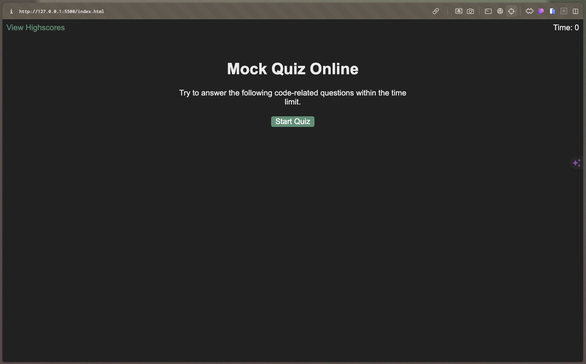

<!-- @format -->

# Mock Online Quiz

## Description

This is a javascript application that takes advantage of Javascript's ability to edit HTML content and create a quiz that all displays on the same page.

## Table of Contents

- [Description](#description)
- [Installation](#installation)
- [Usage](#usage)
- [Deployed Application](#deployed-application)
- [Screenshot](#screenshot)
- [License](#license)

## Installation

No installation required. You can access the application by clicking on the following link: [Online Quiz](https://github.com/jakepears/mockOnlineQuiz)

## Usage

To use the application, click on the link provided in the installation section. Once the application is open, click on the "Generate Password" button. You will be prompted to enter the length of the password you would like to generate. You will then be prompted to select the criteria for the password. You can choose to include lowercase letters, uppercase letters, numbers, and special characters. Once you have selected the criteria, the password will be generated and displayed on the screen.

## Deployed Application

The deployed application can be accessed by clicking on the following link: [Online Quiz](https://jakepears.github.io/mockOnlineQuiz/)

## Screenshot

## License

MIT License
